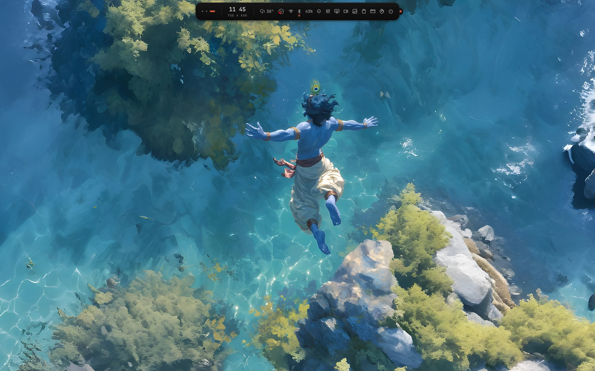
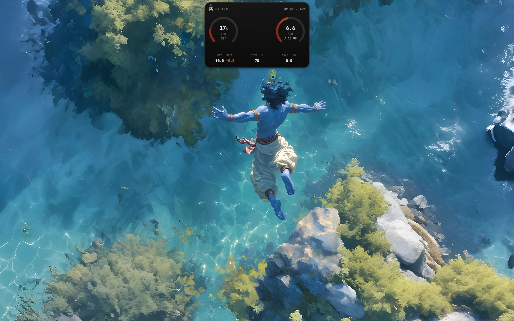
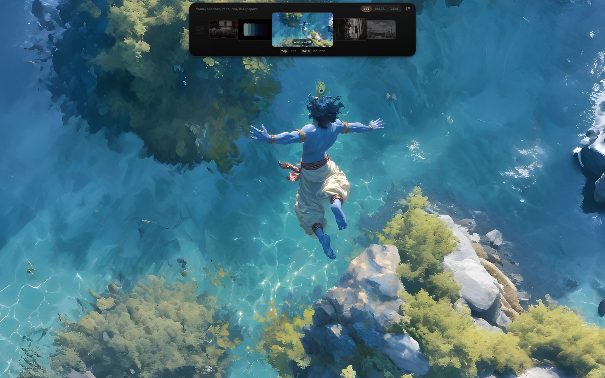

# 浮島 Ukishima

> A dynamic-island Quickshell shell for Hyprland.

Ukishima (浮島, *"floating island"*) is a widget layer for Hyprland built around a single morphing pill at the top of every monitor. Collapsed it is a thin warm-vermillion strip; hover it and it expands in place into a control centre — workspace dots, clock, media, system readouts — and every module grows its own surface out of the pill itself. Nothing ever pops up as a separate panel.

The project is fully self-contained: the config folder holds the QML surfaces, its own scripts and the Hyprland-compat files it generates, so nothing is copied into or sourced from another dotfiles tree.

## Preview

<p align="center">



</p>

See the [full preview gallery](preview/README.md) for all screenshots.

## Credits

Ukishima is built on top of [**Ricelin**](https://github.com/Gakuseei/Ricelin) by [**Gakuseei**](https://github.com/Gakuseei). The pill concept, the morphing-surface architecture and most of the original shell codebase come from there; this project extends, reworks and rebrands it. All credit for the base code goes to the original author.

## Features

- **Dynamic island** — one morphing pill per monitor, expanding in place with a bead cursor and smooth morph animations.
- **Surfaces** grown from the pill: launcher, calendar, media, mixer, wallpaper strip + online search, screen recorder, clipboard history, wifi + hotspot, bluetooth, battery, power menu, system monitor, settings (appearance, fonts), OSD and toasts.
- **Wallpaper system** — `awww` backend with a shuffled bag, per-monitor assignment, animated transitions, video wallpapers (`mpvpaper`), and a live palette that retints the whole UI plus the terminal on every change.
- **Screen recorder** — `gpu-screen-recorder` with slurp window/region picking, countdown, quality presets, audio, and a recent-clips filmstrip.
- **Extras** — night light (hyprsunset), clipboard manager (cliphist), music visualiser (cava), game mode, quick-record keybind, keep-awake.

## Requirements

- Linux + Wayland
- **Hyprland** (developed on 0.56.1, works across recent 0.4x/0.5x)
- **Quickshell** 0.3.0+ built with the Hyprland, Wayland and Io QML modules
- Qt6 / QtQuick (ships with Quickshell)

## Dependencies

### Core

| Tool | Used for |
| --- | --- |
| `quickshell` | shell runtime |
| `hyprctl` | Hyprland IPC (workspaces, monitors, dispatch, reload) |
| `jq` | JSON parsing in the helper scripts |
| `notify-send` (libnotify) | desktop notifications |
| `curl` | weather, wallpaper search / downloads |
| `python3` | palette generation (`wallcolors.py`) |
| `magick` (ImageMagick) | wallpaper thumbnails and palette |
| `awww` + `awww-daemon` | wallpaper backend |
| `ffmpeg` | video-wallpaper still extraction |
| `nmcli` (NetworkManager) | wifi + hotspot surface |
| `bluetoothctl` (bluez) | bluetooth surface |
| `brightnessctl` or `light` | backlight control |
| `cava` | music visualiser |
| `cliphist` + `wl-clipboard` | clipboard history |
| `slurp` | window/region picker for screen recording |
| `hyprsunset` | night light |
| `xdg-open` (xdg-utils) | opening record folder / files |
| systemd (user) | keep-awake inhibitor, hyprsunset service |

### Optional, for full functionality

| Package | Adds |
| --- | --- |
| `gpu-screen-recorder` | the screen-recording backend (recording is disabled without it) |
| `mpvpaper` | animated / video wallpapers |
| `matugen` | Material base16 palettes (always-dark terminal theme) |
| `ddcutil` | monitor brightness via DDC (external display faders) |
| `kdialog` / `zenity` | native folder picker for the record output directory |
| `ghostty` | live terminal palette reload over D-Bus |
| `fastfetch` | recoloured system readout (needs `~/.config/fastfetch/config.jsonc.in`) |
| `hypridle` | idle / DPMS lock integration alongside the built-in keep-awake |

## Install

```bash
./install.sh
```

This copies the project to `~/.local/share/quickshell/ukishima` (override with `UKISHIMA_INSTALL_ROOT`), and reports any missing dependencies. The copy is self-contained.

## Uninstall

There is no uninstall script; remove the install, state and cache folders manually:

```bash
rm -rf "$HOME/.local/share/quickshell/ukishima"
rm -rf "$HOME/.local/state/ukishima"
rm -rf "$HOME/.cache/ukishima"
```

Also remove any references you added yourself: the `source = ~/.config/quickshell/ukishima/modules/*.lua` line in your Hyprland config, the `hyprsunset` user service, and any IPC keybinds.

## Launch

From a clone:

```bash
git clone https://github.com/amanhex/ukishima ~/.config/quickshell/ukishima
quickshell --config "$HOME/.config/quickshell/ukishima"
```

After an `install.sh` install:

```bash
quickshell --config "$HOME/.local/share/quickshell/ukishima"
```

## Hyprland integration

The shell writes its generated files under its own folder (`modules/`, `hyprsunset.conf`). To load the blur layer rule, `source` the generated lua from your Hyprland config:

```conf
source = ~/.config/quickshell/ukishima/modules/*.lua
```

Night light runs as a user service (`hyprsunset`) — create `~/.config/systemd/user/hyprsunset.service` pointing at the installed config and enable it once:

```ini
[Unit]
Description=Hyprsunset night light

[Service]
ExecStart=/usr/bin/hyprsunset --config %h/.config/quickshell/ukishima/hyprsunset.conf

[Install]
WantedBy=default.target
```

```bash
systemctl --user enable --now hyprsunset
```

Ukishima never touches `~/.config/hypr` by default.

## Keybinds (IPC)

Every surface and action is exposed over quickshell IPC (target `ukishima`), so bind them straight in your Hyprland config. Quickshell 0.3+ provides this through the `qs` CLI — `quickshell-ipc` was the pre-0.3 name and no longer exists:

```conf
bind = SUPER, SPACE,  exec, qs -c ukishima ipc call ukishima launcher ""
bind = SUPER, C,      exec, qs -c ukishima ipc call ukishima clipboard ""
bind = SUPER, W,      exec, qs -c ukishima ipc call ukishima wallpaper ""
bind = SUPER, D,      exec, qs -c ukishima ipc call ukishima quickRecord ""
bind = SUPER, M,      exec, qs -c ukishima ipc call ukishima mixer ""
bind = SUPER, B,      exec, qs -c ukishima ipc call ukishima battery ""
bind = SUPER, G,      exec, qs -c ukishima ipc call ukishima gameMode ""
bind = SUPER, S,      exec, qs -c ukishima ipc call ukishima sysmon ""
bind = SUPER, L,      exec, qs -c ukishima ipc call ukishima power ""
bind = SUPER, ESCAPE, exec, qs -c ukishima ipc call ukishima hide
```

The `""` argument is the monitor — empty means "focused monitor", so no hyprctl lookup is needed. The `-c ukishima` must match how you launch the shell; running from a different path needs the same selection there, e.g. `qs -p /path/to/ukishima ipc call ukishima clipboard ""`.

Available IPC handlers: `launcher`, `wallpaper`, `clipboard`, `mixer`, `calendar`, `media`, `power`, `link`, `battery`, `sysmon`/`system`, `recorder`/`screenrec`/`record`, `quickRecord`, `gameMode`, `peek`, `hide`, `page`, `minimizeWindow`, `restoreWindow`. The `page` handler takes the monitor first (empty = focused) and the surface name second, so surfaces without a dedicated handler open as `qs -c ukishima ipc call ukishima page "" wifi`.

## Layout

All paths resolve at runtime relative to this project folder (`Singletons/Config.qml` self-locates it), so the shell works regardless of where it was launched from:

- shell entry: `shell.qml` (+ the pill body `Pill.qml` at the root)
- surfaces: `surfaces/` — the panels the pill morphs into
- components: `components/` — reusable widgets (pill surface base, glyphs, settings kit, …)
- singletons: `Singletons/` — one per-service singleton (`Config`, `Flags`, `Theme`, `Walls`, `Players`, …)
- helpers: `lib/` — pure JS (`fuzzy.js`, `calc.js`, `binds.js`, …)
- scripts: `scripts/` — wallpaper set/thumb/search, palette (`wallpaper.sh`, `wallcolors.py`, …)
- Hyprland-compat outputs: `modules/*.lua`, `hyprsunset.conf` under this folder

## State & cache

- state: `$XDG_STATE_HOME/ukishima` (default `~/.local/state/ukishima`) — flags, events, wallpaper state, launcher usage
- cache: `$XDG_CACHE_HOME/ukishima` (default `~/.cache/ukishima`) — palette JSON, weather, rec thumbs; wallpaper previews under `ukishima-wp-thumbs/`
